```mermaid
graph TB
    subgraph "Organization Dataset Fields"
        A["🔑 id<br/>Record ID<br/>SingleLine.Text<br/>✅ Required"]
        B["👤 name<br/>Person Name<br/>SingleLine.Text<br/>✅ Required"]
        C["💼 position<br/>Position Title<br/>SingleLine.Text<br/>❌ Optional"]
        D["👨‍💼 managerId<br/>Manager ID<br/>SingleLine.Text<br/>❌ Optional"]
        E["📧 email<br/>Email<br/>SingleLine.Text<br/>❌ Optional"]
        F["🆔 ag_userid<br/>User ID<br/>SingleLine.Text<br/>❌ Optional"]
    end
    
    style A fill:#ff9999
    style B fill:#ff9999
    style C fill:#99ccff
    style D fill:#99ccff
    style E fill:#99ccff
    style F fill:#99ccff
```

```mermaid
graph TB
    subgraph "Surveys Dataset Fields"
        A["🔑 msfp_surveyid<br/>Survey ID<br/>SingleLine.Text<br/>✅ Required"]
        B["📋 msfp_name<br/>Survey Name<br/>SingleLine.Text<br/>✅ Required"]
        C["🔗 msfp_surveyurl<br/>Survey URL<br/>SingleLine.Text<br/>❌ Optional"]
        D["📁 msfp_projectid<br/>Project ID<br/>SingleLine.Text<br/>❌ Optional"]
        E["📝 msfp_description<br/>Survey Description<br/>Multiple<br/>❌ Optional"]
    end
    
    style A fill:#ff9999
    style B fill:#ff9999
    style C fill:#99ccff
    style D fill:#99ccff
    style E fill:#99ccff
```

```mermaid
graph TB
    subgraph "Survey Responses Dataset Fields"
        A["🔑 responseId<br/>Response ID<br/>SingleLine.Text<br/>✅ Required"]
        B["🔗 survey_id<br/>Survey ID Response<br/>SingleLine.Text<br/>✅ Required"]
        C["👤 personId<br/>Person ID Response<br/>SingleLine.Text<br/>✅ Required"]
        D["🔗 responseUrl<br/>Response URL<br/>SingleLine.Text<br/>❌ Optional"]
        E["📅 responseDate<br/>Response Date<br/>DateAndTime<br/>❌ Optional"]
    end
    
    style A fill:#ff9999
    style B fill:#ff9999
    style C fill:#ff9999
    style D fill:#99ccff
    style E fill:#99ccff
```

# Database Schema - OrganizationTreeV2 PCF Control

This document describes the database schema and data requirements for the OrganizationTreeV2 Power Platform Control Framework (PCF) component.

## Overview

The OrganizationTreeV2 control integrates with Microsoft Dataverse and requires three main datasets:
1. **Organization Dataset** - Hierarchical employee/organizational data
2. **Surveys Dataset** - Microsoft Customer Voice survey information
3. **Survey Responses Dataset** - Individual survey response records

## Required Datasets

### 1. Organization Dataset (`organizationDataSet`)

This dataset contains the hierarchical organizational structure with employee information.

#### Required Fields



#### Data Structure Example
```json
{
  "id": "emp001",
  "name": "John Smith",
  "position": "Senior Developer",
  "managerId": "emp002",
  "email": "john.smith@company.com",
  "ag_userid": "{12345678-1234-1234-1234-123456789012}"
}
```

#### Relationships
- **Hierarchical**: `managerId` field creates parent-child relationships
- **Self-referencing**: `managerId` points to another record's `id` in the same dataset

---

### 2. Surveys Dataset (`surveysDataSet`)

This dataset contains Microsoft Customer Voice survey definitions.

#### Required Fields



#### Data Structure Example
```json
{
  "msfp_surveyid": "survey123",
  "msfp_name": "Employee Satisfaction Q3 2025",
  "msfp_surveyurl": "https://customervoice.microsoft.com/...",
  "msfp_projectid": "project456",
  "msfp_description": "Quarterly employee satisfaction survey covering work environment, management, and career development."
}
```

---

### 3. Survey Responses Dataset (`surveyResponsesDataSet`)

This dataset tracks individual survey responses from employees.

#### Required Fields



#### Data Structure Example
```json
{
  "responseId": "resp789",
  "survey_id": "survey123",
  "personId": "emp001",
  "responseUrl": "https://customervoice.microsoft.com/responses/...",
  "responseDate": "2025-09-11T10:30:00Z"
}
```

#### Relationships
- **Survey Link**: `survey_id` → `surveysDataSet.msfp_surveyid`
- **Person Link**: `personId` → `organizationDataSet.id`

---

## Configuration Properties

### Input Properties

```mermaid
graph LR
    subgraph "Configuration Properties"
        A["📁 projectId<br/>Project ID<br/>SingleLine.Text<br/>❌ Optional<br/>Customer Voice project ID for filtering"]
    end
    
    style A fill:#ffffcc
```



---

## Data Relationships Diagram


---

## Implementation Notes

### 1. Hierarchy Building
- The control builds hierarchical trees using `managerId` relationships
- Root nodes are records with `null` or empty `managerId`
- Circular references should be avoided in the data

### 2. User Context
- `ag_userid` field is used to identify the current user
- Supports both full GUID format and cleaned GUID format
- Used for "team view" filtering functionality

### 3. Survey Integration
- Surveys are filtered by `msfp_projectid` if `projectId` property is provided
- Survey URLs are enhanced with person context when launching
- Response tracking shows completion status per person

### 4. Performance Considerations
- Control loads up to 1500 records per dataset by default
- Implements pagination for large datasets
- Considers indexing `managerId`, `ag_userid`, `survey_id`, and `personId` fields

### 5. Data Quality Requirements
- Ensure `managerId` values exist as valid `id` values in the same dataset
- Maintain referential integrity between datasets
- Handle missing/null values gracefully in optional fields

---

## Microsoft Dataverse Setup

### Recommended Entity Configuration

1. **Custom Entity**: `ag_organizationmember`
   - Maps to Organization Dataset
   - Consider using Dataverse relationship features for hierarchy

2. **Customer Voice Integration**:
   - Use native `msfp_survey` and `msfp_surveyresponse` entities when possible
   - Ensure proper field mapping in PCF configuration

3. **Views and Filters**:
   - Create optimized views for the three datasets
   - Include necessary filters for performance
   - Consider using FetchXML for complex hierarchy queries

---

## Security Considerations

- Ensure users have appropriate read permissions on all three datasets
- Consider row-level security for sensitive organizational data
- Survey response data may contain confidential information
- Implement proper field-level security where needed

---

*Last Updated: September 11, 2025*
*Version: 1.0*
